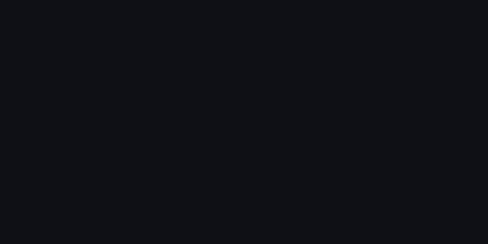

 

**block-vision** is a sleek terminal-based interface for real-time cryptocurrency prices, powered by the CoinMarketCap API. Built with Go, it's perfect for crypto enthusiasts who love working from the command line.

## Showcase

## Roadmap

This is just the beginning! **block-vision** has a lot of room to grow and evolve.

- [x] View trending cryptocurrencies
- [ ] Search cryptocurrencies and view info
- [ ] View portfolio w/ Metamask sign-in

## Technologies Used

| Technology    | Purpose                                       |
|---------------|-----------------------------------------------|
| [Bubble Tea](https://github.com/charmbracelet/bubbletea)    | MVC framework for building terminal UIs      |
| [Lipgloss](https://github.com/charmbracelet/lipgloss)       | Styling for text and colors in the terminal   |
| [Bubbles](https://github.com/charmbracelet/bubbles)         | Component library for terminal UIs         |
| [CoinGecko API](https://www.coingecko.com/en/api)           | Fetches real-time cryptocurrency data        |

## Contributing

Contributions are welcome! Feel free to open an issue or submit a pull request to improve block-vision.

## License

This project is licensed under the MIT License. See the [LICENSE](LICENSE) file for details.